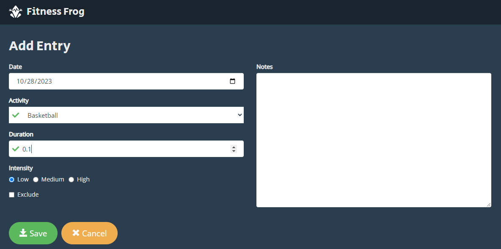

# FitnessFrog
This repository has two projects.
1. FitnessFrogForm: ASP.NET MVC Forms Project.
2. FitnessFrogAPI: ASP.NET Web API Project.

I followed two courses of James Churchill from Treehouse.
1. ASP.NET MVC Forms
2. Building Services with ASP.NET Web API

## FitnessFrogForm
This is a project for ASP.NET MVC Forms. \
I followed the course "ASP.NET MVC Forms" by James Churchill from Treehouse.\
It contains two folders. 
1. To see the final project look into the folder "FitnessFrog_DIY". 
2. For step by step process look into the folder "FitnessFrog_Treehouse".

## Fitness Frog API
This API supports the following user actions.
1. Viewing a list of entries
2. Adding an entry
3. Editing an entry
4. Deleting an entry

It contains two folders. 
1. To see the final project look into the folder "FitnessFrogService_DIY". 
2. For step by step process look into the folder "FitnessFrogService_Treehouse".

### Project Setup

Open the project in Visual Studio.
Then go to Tools > Nuget Pckage Manager > Package Manager Console \
Then run the following command\

`
Update-Package Microsoft.CodeDom.Providers.DotNetCompilerPlatform -r
`

After that build the project.
For all the training folders, Right click on "Treehouse.FitnessFrog.Spa" project, and then "Set as Startup Project"

### URI/Endpoints:
* Api/entries GET, POST
* Api/entries/1 GET, PUT, DELETE
* Api/activities GET, POST
* Api/intensities GET, POST

### HTTP Status Codes
* 200 Ok
* 201 Created
* 204 No Content

## Project Demo of FitnessFrogForm
### Home Page

### Add Page

## Project Demo of FitnessFrogAPI
### Home Page

### Add Page

### Edit Page

### Delete Page
